# Azure Key Vault Policy Governance - Workflow Diagram

**Version**: 1.0  
**Last Updated**: 2026-01-16  
**Purpose**: Visual reference for all deployment and testing workflows

---

## Complete Workflow Overview

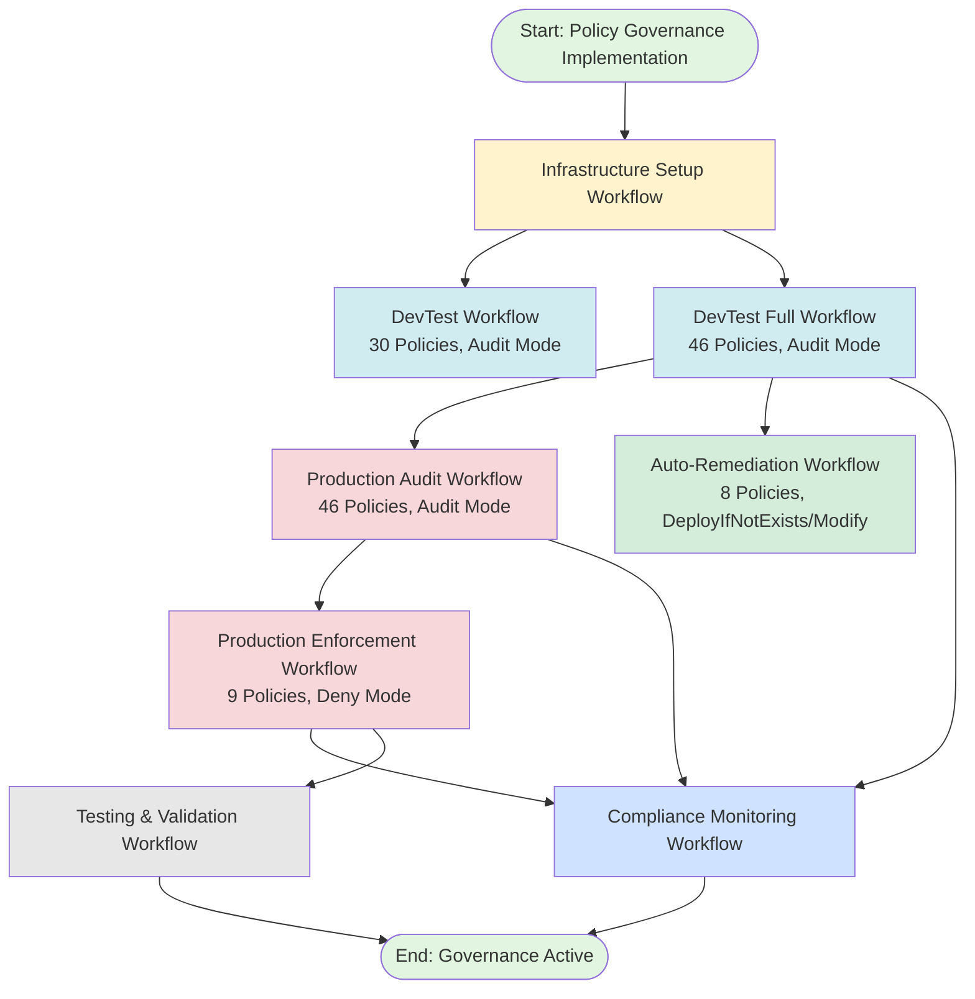

---

## Workflow 1: Infrastructure Setup

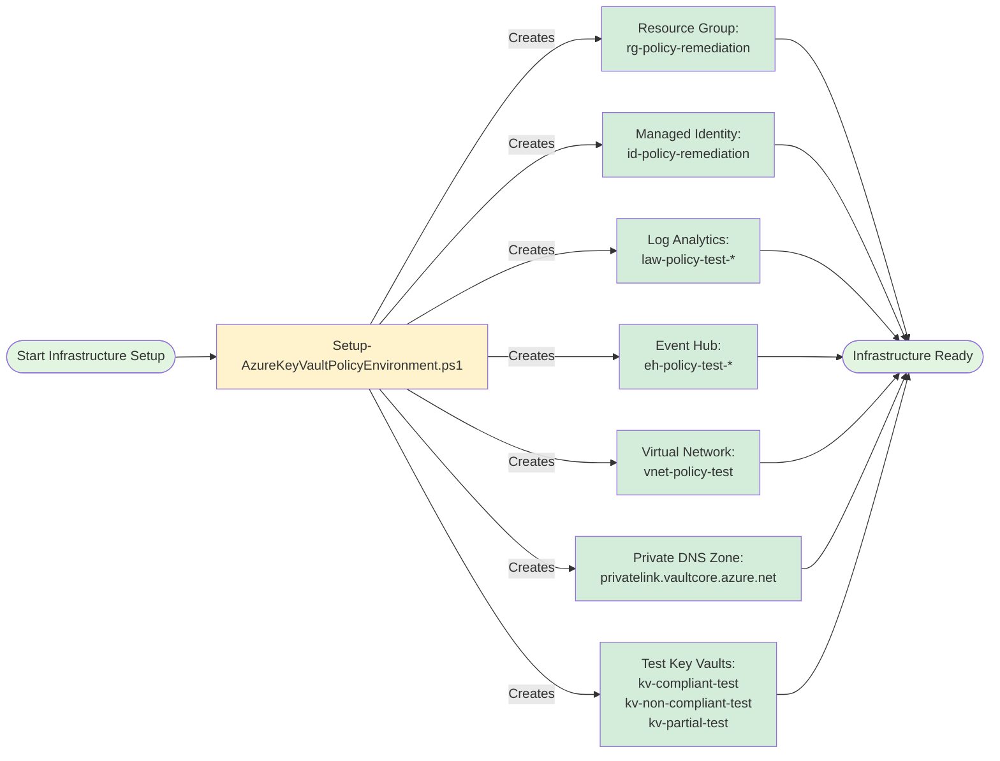

**Command**:
```powershell
.\Setup-AzureKeyVaultPolicyEnvironment.ps1 -CreateTestEnvironment
```

**Outputs**:
- Azure resources created (no files)
- Console logs with resource IDs

---

## Workflow 2: DevTest Deployment (30 Policies)

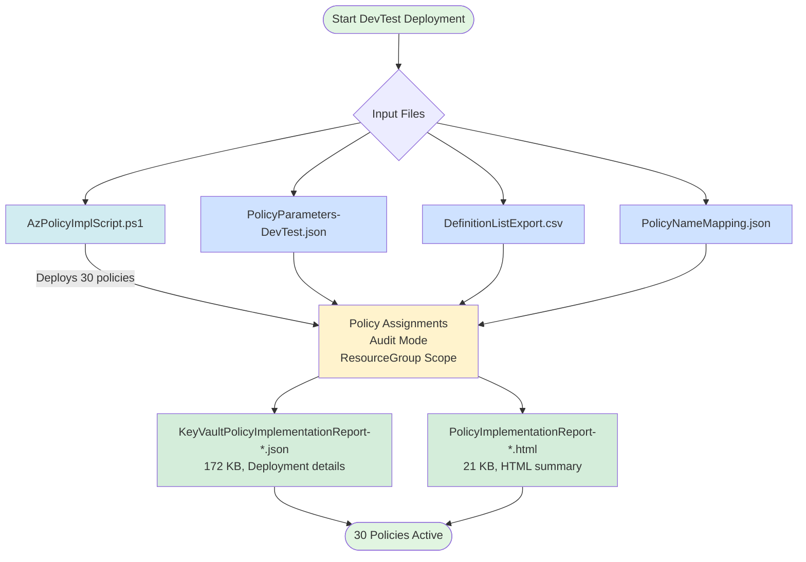

**Command**:
```powershell
.\AzPolicyImplScript.ps1 -DeployDevTest -SkipRBACCheck
```

**Outputs**:
- `KeyVaultPolicyImplementationReport-[timestamp].json` (172 KB)
- `PolicyImplementationReport-[timestamp].html` (21 KB)

---

## Workflow 3: DevTest Full Deployment (46 Policies)

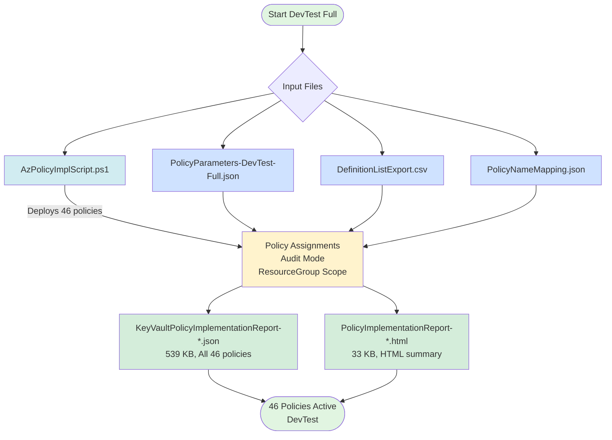

**Command**:
```powershell
.\AzPolicyImplScript.ps1 -ParameterFile .\PolicyParameters-DevTest-Full.json -SkipRBACCheck
```

**Outputs**:
- `KeyVaultPolicyImplementationReport-[timestamp].json` (539 KB)
- `PolicyImplementationReport-[timestamp].html` (33 KB)

---

## Workflow 4: Production Audit Deployment (46 Policies)

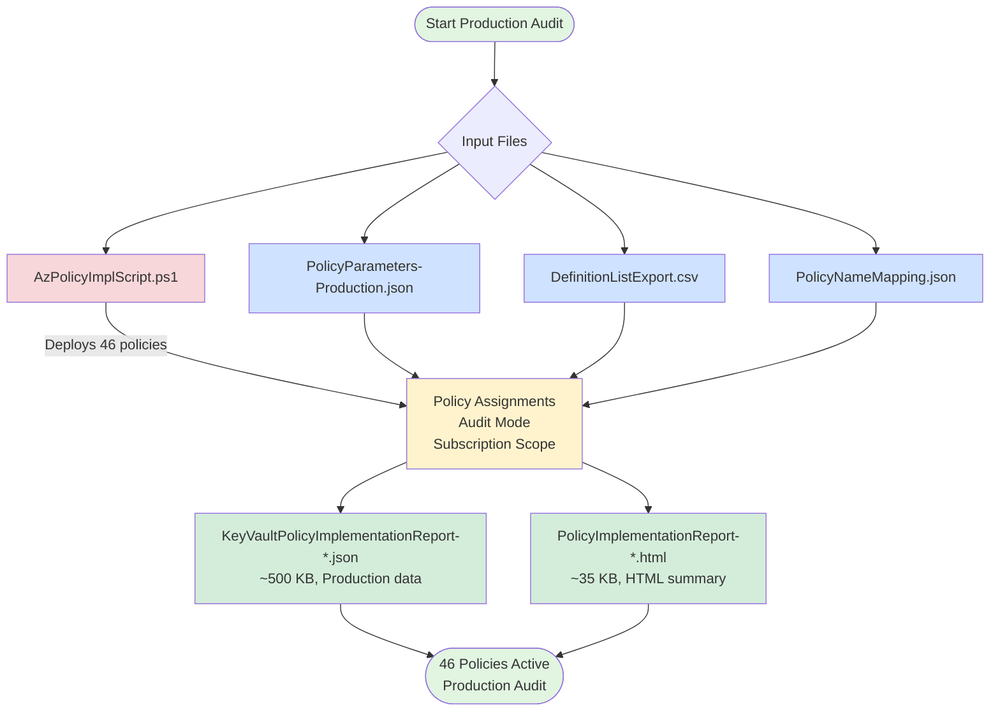

**Command**:
```powershell
.\AzPolicyImplScript.ps1 -DeployProduction -SkipRBACCheck
```

**Outputs**:
- `KeyVaultPolicyImplementationReport-[timestamp].json` (~500 KB)
- `PolicyImplementationReport-[timestamp].html` (~35 KB)

---

## Workflow 5: Production Enforcement (9 Tier 1 Deny Policies)

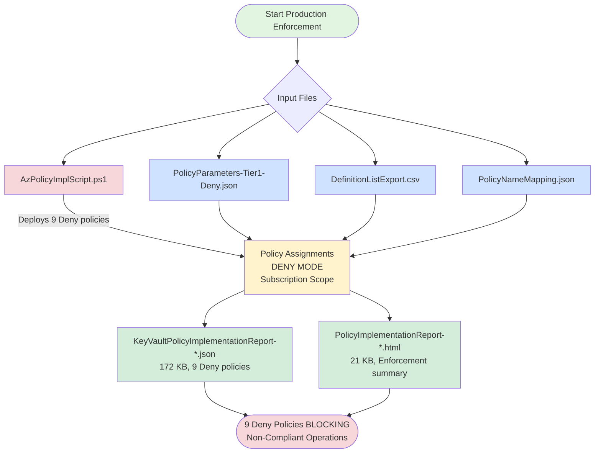

**Command**:
```powershell
.\AzPolicyImplScript.ps1 -ParameterFile .\PolicyParameters-Tier1-Deny.json -SkipRBACCheck
```

**Outputs**:
- `KeyVaultPolicyImplementationReport-[timestamp].json` (172 KB)
- `PolicyImplementationReport-[timestamp].html` (21 KB)

---

## Workflow 6: Auto-Remediation (8 Policies)

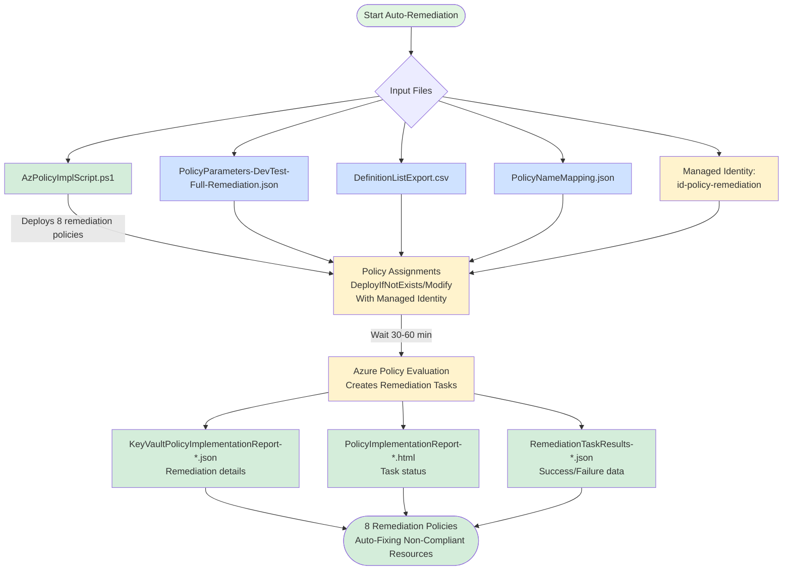

**Commands**:
```powershell
# Deploy remediation policies
.\AzPolicyImplScript.ps1 -ParameterFile .\PolicyParameters-DevTest-Full-Remediation.json `
    -IdentityResourceId "/subscriptions/.../id-policy-remediation" -SkipRBACCheck

# Test auto-remediation (creates test vault, waits for policy evaluation)
.\AzPolicyImplScript.ps1 -TestAutoRemediation -SkipRBACCheck
```

**Outputs**:
- `KeyVaultPolicyImplementationReport-[timestamp].json` (remediation details)
- `PolicyImplementationReport-[timestamp].html` (task status)
- `RemediationTaskResults-[timestamp].json` (success/failure data)

---

## Workflow 7: Compliance Monitoring

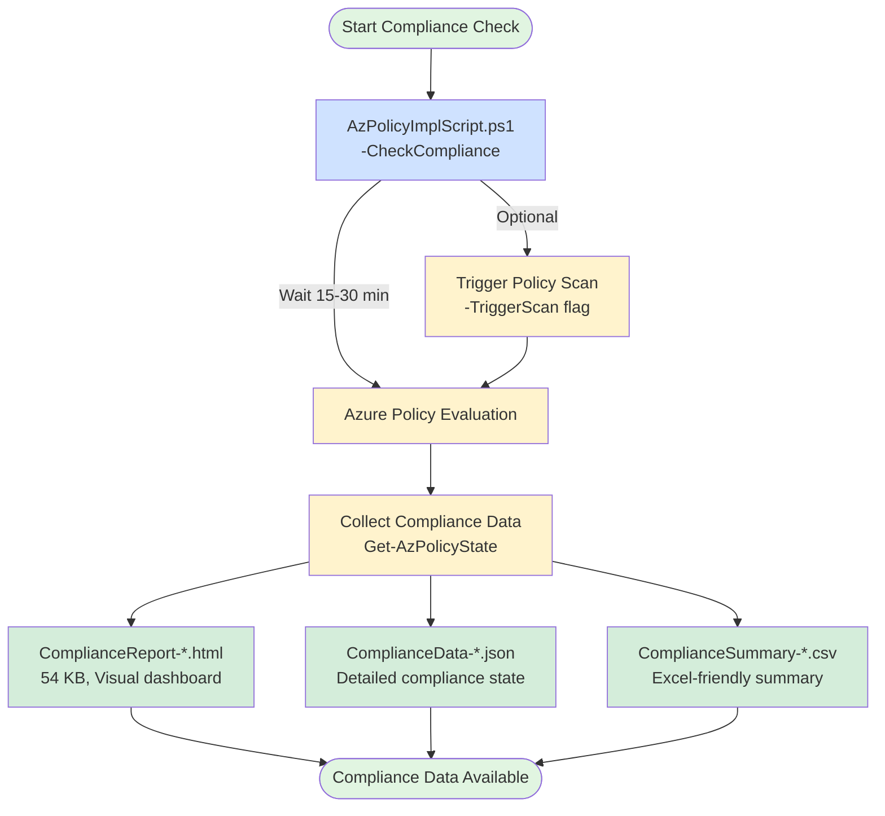

**Commands**:
```powershell
# Check compliance (uses cached data)
.\AzPolicyImplScript.ps1 -CheckCompliance -SkipRBACCheck

# Check compliance with fresh scan (triggers Azure Policy evaluation)
.\AzPolicyImplScript.ps1 -CheckCompliance -TriggerScan -SkipRBACCheck
```

**Outputs**:
- `ComplianceReport-[timestamp].html` (54 KB, visual dashboard)
- `ComplianceData-[timestamp].json` (detailed state)
- `ComplianceSummary-[timestamp].csv` (Excel-friendly)

---

## Workflow 8: Testing & Validation

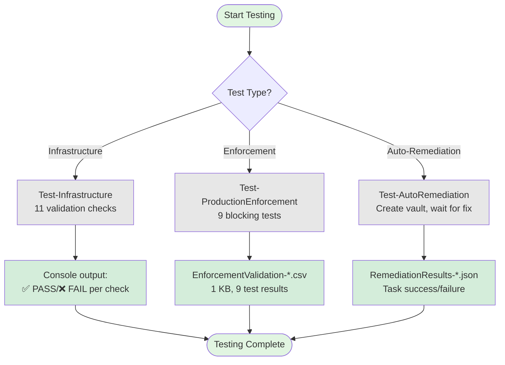

**Commands**:
```powershell
# Test infrastructure (11 checks: managed identity, Log Analytics, Event Hub, VNet, etc.)
.\AzPolicyImplScript.ps1 -TestInfrastructure -Detailed -SkipRBACCheck

# Test enforcement blocking (9 tests: soft delete, purge protection, firewall, RBAC, keys, secrets, certificates)
.\AzPolicyImplScript.ps1 -TestProductionEnforcement -SkipRBACCheck

# Test auto-remediation (creates non-compliant vault, waits for Azure Policy to fix it)
.\AzPolicyImplScript.ps1 -TestAutoRemediation -SkipRBACCheck
```

**Outputs**:
- Infrastructure: Console output (11 validation checks)
- Enforcement: `EnforcementValidation-[timestamp].csv` (9 test results)
- Remediation: `RemediationResults-[timestamp].json` (task details)

---

## Complete File Dependency Map

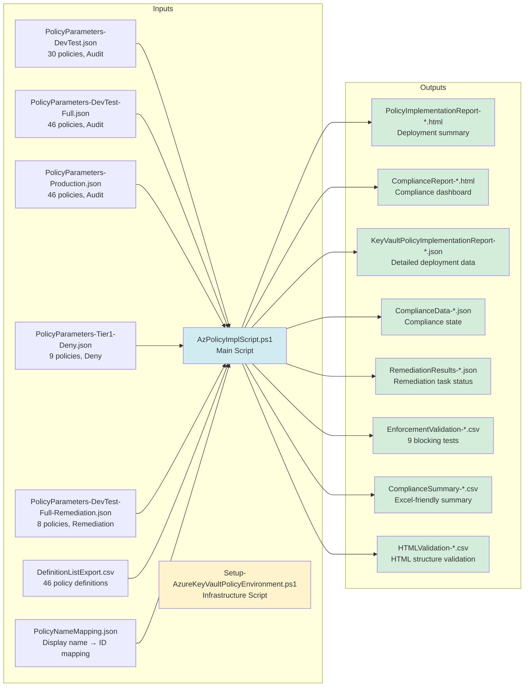

---

## Phased Deployment Timeline

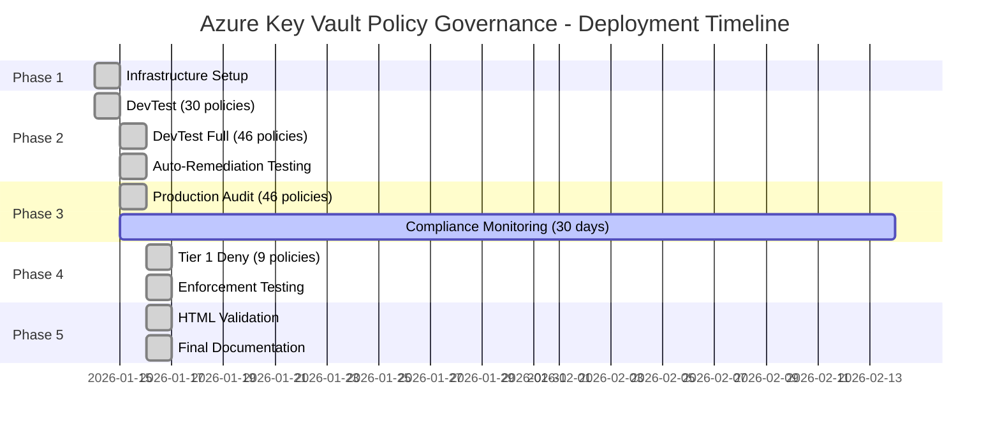

---

## Quick Reference Table

| Workflow | Parameter File | Policies | Mode | Scope | Command | Key Outputs |
|----------|---------------|----------|------|-------|---------|-------------|
| **Infrastructure** | N/A | 0 | N/A | Subscription | `Setup-AzureKeyVaultPolicyEnvironment.ps1 -CreateTestEnvironment` | Azure resources |
| **DevTest (30)** | PolicyParameters-DevTest.json | 30 | Audit | ResourceGroup | `AzPolicyImplScript.ps1 -DeployDevTest -SkipRBACCheck` | Implementation JSON/HTML |
| **DevTest Full (46)** | PolicyParameters-DevTest-Full.json | 46 | Audit | ResourceGroup | `AzPolicyImplScript.ps1 -ParameterFile .\PolicyParameters-DevTest-Full.json -SkipRBACCheck` | Implementation JSON/HTML |
| **Production Audit** | PolicyParameters-Production.json | 46 | Audit | Subscription | `AzPolicyImplScript.ps1 -DeployProduction -SkipRBACCheck` | Implementation JSON/HTML |
| **Tier 1 Deny** | PolicyParameters-Tier1-Deny.json | 9 | **Deny** | Subscription | `AzPolicyImplScript.ps1 -ParameterFile .\PolicyParameters-Tier1-Deny.json -SkipRBACCheck` | Implementation JSON/HTML |
| **Auto-Remediation** | PolicyParameters-DevTest-Full-Remediation.json | 8 | DeployIfNotExists/Modify | ResourceGroup | `AzPolicyImplScript.ps1 -ParameterFile .\PolicyParameters-DevTest-Full-Remediation.json -IdentityResourceId "..." -SkipRBACCheck` | Remediation JSON |
| **Compliance Check** | N/A | All active | All | All | `AzPolicyImplScript.ps1 -CheckCompliance -TriggerScan -SkipRBACCheck` | Compliance HTML/JSON/CSV |
| **Test Infrastructure** | N/A | N/A | N/A | N/A | `AzPolicyImplScript.ps1 -TestInfrastructure -Detailed -SkipRBACCheck` | Console output |
| **Test Enforcement** | N/A | 9 | Deny | Subscription | `AzPolicyImplScript.ps1 -TestProductionEnforcement -SkipRBACCheck` | EnforcementValidation CSV |
| **Test Remediation** | N/A | 8 | DeployIfNotExists/Modify | ResourceGroup | `AzPolicyImplScript.ps1 -TestAutoRemediation -SkipRBACCheck` | Remediation JSON |

---

## Output File Legend

| File Pattern | Size | Content | Use Case |
|-------------|------|---------|----------|
| **PolicyImplementationReport-[timestamp].html** | 21-35 KB | HTML summary of policy deployment with success/failure counts | Quick visual review of deployment |
| **KeyVaultPolicyImplementationReport-[timestamp].json** | 172-539 KB | Complete JSON data: all policies, parameters, assignment IDs, timestamps | Programmatic analysis, audit trail |
| **ComplianceReport-[timestamp].html** | 54-97 KB | Visual compliance dashboard with charts, policy breakdowns, security metrics | Executive reporting, compliance review |
| **ComplianceData-[timestamp].json** | Varies | Detailed compliance state for every resource evaluated by Azure Policy | Deep analysis, troubleshooting |
| **ComplianceSummary-[timestamp].csv** | Small | Excel-friendly summary of compliance percentages | Spreadsheet analysis |
| **EnforcementValidation-[timestamp].csv** | 1 KB | 9 test results: Test ID, Policy, Operation, Expected Result, Actual Result, Status | Validation that Deny policies block correctly |
| **HTMLValidation-[timestamp].csv** | <1 KB | HTML structure validation results for compliance reports | Quality assurance |
| **IndividualPolicyValidation-[timestamp].txt** | 3 KB | Detailed test logs for each of 9 Deny policies | Troubleshooting test failures |
| **RemediationResults-[timestamp].json** | Varies | Auto-remediation task status: task ID, success/failure, resource fixed | Monitor automated fixes |

---

**Last Updated**: 2026-01-16  
**Version**: 1.0  
**Repository**: powershell-akv-policyhardening
